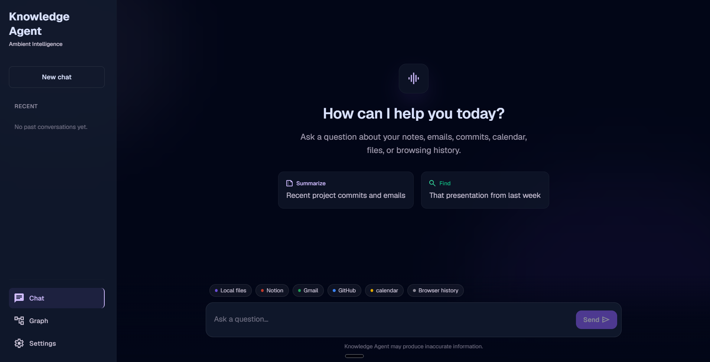
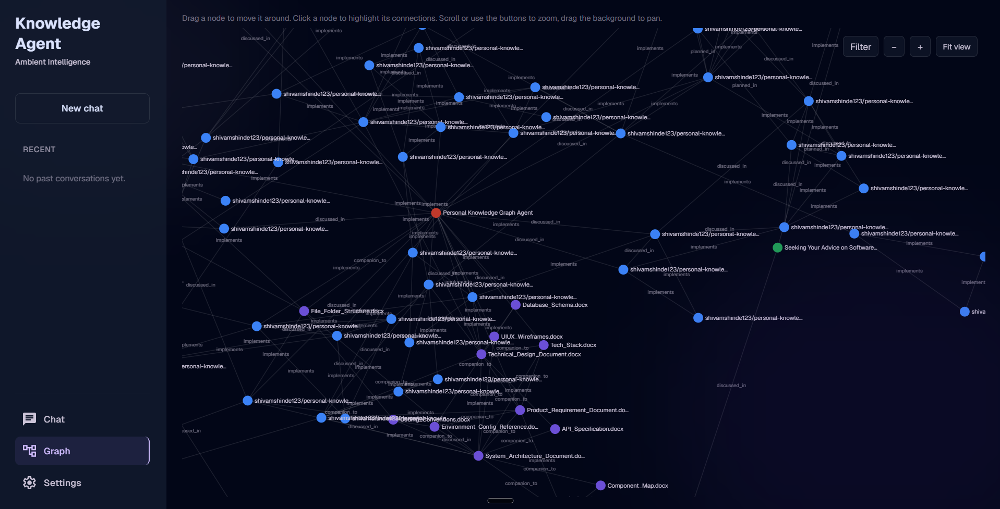
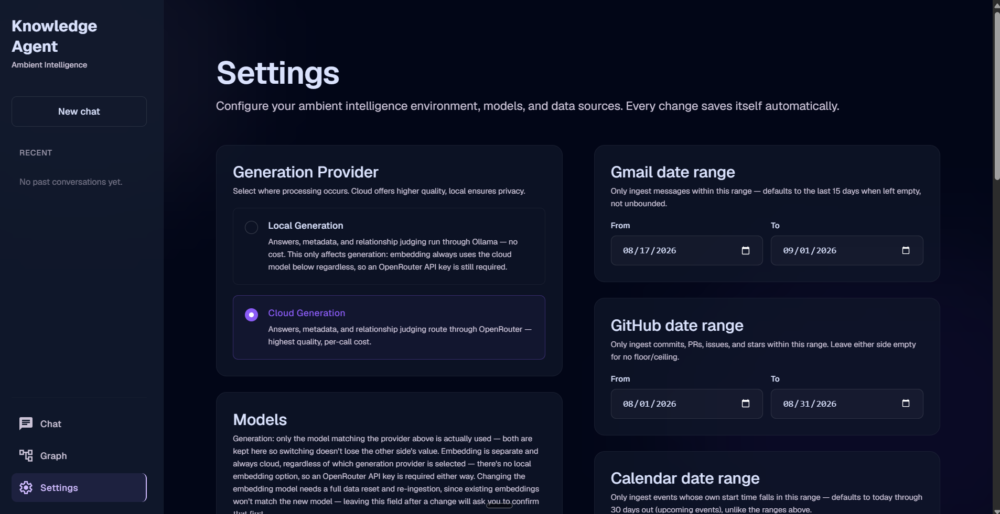

# Personal Knowledge Graph Agent

A fully local, privacy-first system that continuously ingests one person's data
from six sources — **Local Files, Notion, Gmail, GitHub, Google Calendar, and
Browser History** — links it across sources, and answers natural language
questions about it through a LangGraph agent, with a chat UI and a live
relationship graph.

Everything runs on one machine, for one user. There is no multi-tenant layer,
no hosted database, and no authentication — by design. It's built primarily as
a portfolio project demonstrating applied depth in LangChain, LangGraph, and
LangSmith, and secondarily as a genuinely useful personal tool.

> **Docker packaging for easy install/distribution is planned as the last
> step**, once the current feature set is fully tested end-to-end — see
> [Roadmap](#roadmap). Until then, running this means a manual developer
> setup (below).

<p align="center">
  
  <br />
  
</p>

## What it does

The system ingests from all six sources once a day (or on demand), filters out
noise, chunks and embeds what survives, detects relationships across sources,
and makes the result queryable through a chat interface:

> _"What did I work on related to RAG pipelines in the last 2 months?"_

The answer comes back synthesized and cited, with links back to the original
Notion page, email thread, commit, calendar event, or file. A separate graph
view lets you visually explore every confirmed relationship between items.

**Highlights:**

- Six independent extractors — one source failing never blocks the others.
- Hybrid search (semantic + keyword) merged with a relationship-graph lookup,
  routed automatically per question.
- Relationships between items are detected automatically and confirmed by an
  LLM before being stored.
- Choice of a fully local LLM (Ollama) or a fully cloud one (OpenRouter, any
  supported model), switchable from Settings.
- A chat interface, a settings screen for configuring every source, and an
  interactive graph view of the whole knowledge base.

## How it works

### Ingestion pipeline

Each of the six extractors normalizes what it pulls into a common shape
(title, raw text, timestamps, source reference) before handing it to a shared
pipeline:

1. **Noise filtering** happens in two layers. Source-specific rules run
   first, inside each extractor, since only it has access to that source's
   native data: Browser History drops URLs below a minimum visit count and
   anything matching a domain blocklist (search engines, social media);
   Gmail drops messages under excluded labels (promotions, social); Calendar
   drops recurring events with no description (standing reminders, not real
   meetings). Everything that survives then passes through one universal
   filter — anything empty or shorter than a minimum content length is
   dropped as noise, regardless of source.
2. **Chunking** splits the surviving text at natural paragraph boundaries,
   packed to a target size; a single paragraph too long to fit on its own
   falls back to a sliding window with overlap, since there's no natural
   break to prefer instead.
3. **Metadata generation** derives a project name and topic per item via an
   LLM call, batched across several items per call rather than one at a time.
4. **Embedding** turns each chunk into a vector.

From there, data lands in three places: the raw text and metadata go to
**SQLite** (also indexed for keyword search), the chunk vectors go to
**Chroma**, and — once relationship detection runs — confirmed relationships
go to **Neo4j**. A query at answer time reads from all three: SQLite and
Chroma for retrieval, Neo4j for relationship lookups.

### Models: local vs. cloud

The **Generation Provider** setting is a single toggle between two models,
used for every *generation* task — metadata extraction, relationship
judging, and answer synthesis:

- **Local Generation** — runs through Ollama, no per-call cost.
- **Cloud Generation** — runs through OpenRouter, any supported model,
  highest quality, per-call cost.

**Embedding is separate and always cloud**, regardless of which generation
provider is selected — there is no local embedding path, so an OpenRouter API
key is required either way. Changing the embedding model requires a full
data reset and re-ingestion, since existing vectors won't match the new
model's space.

### A note on ingestion cost and time — local is preferred

Ingestion time and, under Cloud Generation, real dollar cost both scale
with **how many items get processed and related**, not with how the sources
are configured otherwise. Two things drive that count far more than
anything else:

- **Relationship detection dominates the time.** Every processed item
  (aside from Browser History, which is excluded entirely) is checked
  against the rest of the knowledge base for relationships — a vector
  search plus one or more LLM confirmation calls, per item. This step alone
  can take several times longer than extracting and storing the same items
  in the first place, especially under Cloud Generation, where each
  confirmation is a network round trip.
- **GitHub is usually the largest single contributor**, because commits,
  PRs, issues, and starred repos have no date range configured by default —
  every repository's *entire* history is pulled and related on the first
  run. A handful of long-lived repositories can easily produce more items
  than every other source combined.

In practice, a real run of just this project's own repository plus a
handful of other sources — a few hundred items in total — took a few hours
and cost real money on Cloud Generation, almost entirely from GitHub's
unbounded history. Scaling that up to many projects/repositories at once,
each with similarly long history, without narrowing GitHub's date range
first, can realistically stretch into many hours (or longer) and a
correspondingly larger cloud bill.

**Local Generation is the preferred choice for any ingestion at meaningful
scale** — it has no per-call cost, and while it depends on local hardware for
speed, it doesn't turn a large backfill into an open-ended cloud expense.
Cloud Generation is better suited to smaller, more selective ingestion
scopes, or to answer synthesis at query time (a single call per question)
rather than the ingestion-time relationship-detection step. Narrowing
GitHub's (and any other source's) date range before a large first run is
the single most effective way to control both time and cost regardless of
which provider is chosen.

### How the relationship graph is created

After a batch finishes storing items, each one is checked against the rest
of the knowledge base: its nearest neighbors are found by vector similarity
first (never a full-dataset comparison), and only those candidates are
then judged by an LLM, which labels the relationship (e.g. `implements`,
`discussed_in`) and a confidence score. Judgments below a confidence
threshold are discarded. Browser History is excluded from this step entirely
— it's intentionally the lightest-weight source, title and URL only.

Confirmed relationships become edges in Neo4j; an item with no confirmed
relationship to anything simply has no node in the graph — an unconnected
item wouldn't add anything to a relationship view. The frontend renders the
result as a live, force-directed graph: drag a node and its neighbors
resettle around it, click one to highlight its connections, and filter by
source from the toolbar.

## Settings

<p align="center">
  
</p>

Every setting is editable from the Settings screen and saves itself
immediately — no separate save step.

| Setting | Default |
|---|---|
| Generation provider | Cloud |
| Local generation model | `llama3:8b` |
| Cloud generation model | `anthropic/claude-sonnet-4` |
| Embedding model (always cloud) | `openai/text-embedding-3-small` |
| Local folders to watch | none |
| Notion page scope | unscoped — every page the integration can see |
| GitHub repository scope | unscoped — every accessible repo |
| Gmail date range | last 15 days |
| GitHub date range | unbounded |
| Calendar date range | today through 30 days out |

The screen also shows live ingestion progress, lets you trigger or stop a
run on demand, shows each source's connection status, and has a "reset
everything" option for starting over.

## Architecture

Six layers, each depending only on the layer below it:

| Layer | Responsibility | Where |
|---|---|---|
| **Data Sources** | Notion, Gmail, GitHub, Google Calendar, filesystem, browser | (external) |
| **Ingestion** | Extraction, noise filtering, chunking, metadata, embeddings | `extractors/`, `pipeline/` |
| **Understanding & Storage** | SQLite + FTS5, Chroma (embedded), Neo4j Community Edition | `storage/` |
| **Query & Reasoning** | LangGraph: Router → Search nodes → Merger → Synthesizer | `agent/` |
| **Interface** | FastAPI backend + React chat/graph/settings UI | `api/`, `frontend/` |
| **Evaluation** | LangSmith tracing, datasets, evaluators | `eval/` |

Ingestion runs as a scheduled daily batch (also triggerable on demand from
Settings), kept separate from the API process so a long-running batch never
blocks the app or takes it down if something goes wrong.

## Tech stack

| Concern | Choice |
|---|---|
| Agent orchestration | LangGraph, LangChain |
| Observability/eval | LangSmith |
| Backend | FastAPI (Python ≥3.12) |
| Frontend | React 19, Vite |
| Relational/keyword store | SQLite + FTS5 (BM25) |
| Vector store | Chroma (embedded, local) |
| Graph store | Neo4j Community Edition (local) |
| LLM/embeddings | Ollama (local) or OpenRouter (cloud) |
| Package management | [uv](https://docs.astral.sh/uv/) (Python), npm (frontend) |

Full rationale for each choice is in `docs/Tech_Stack.docx`.

## Repository layout

```
extractors/    one module per data source
pipeline/      noise filtering, chunking, metadata generation, embeddings, relationship detection
storage/       SQLite, Chroma, and Neo4j stores
providers/     LLM provider abstraction (local vs. cloud)
agent/         LangGraph node wiring — router, search, synthesizer
api/           FastAPI app and routes
frontend/      React app — chat, graph, and settings screens
scheduler/     the daily ingestion batch entrypoint
eval/          LangSmith evaluation runner and test questions
config/        typed settings, config.yaml, .env.example
tests/         mirrors the source tree
docs/          the original design document set — see the note below
```

## Setup (developer / manual)

**Prerequisites**: [uv](https://docs.astral.sh/uv/), Node.js + npm, a running
Neo4j Community Edition instance, and (only for local inference) Ollama.

```bash
# Backend
uv sync
cp config/.env.example config/.env   # fill in the values you need
uv run pytest
uv run python -m api.main

# Frontend (separate terminal)
cd frontend
npm install
npm run dev
```

`config/.env.example` documents every credential/path the extractors need;
`config/config.yaml` holds non-secret settings (provider mode, chunking,
retrieval). Everything is also editable from the Settings screen once the app
is running. Full setup steps — including the one-time OAuth consent needed
for Gmail and Google Calendar — are in `docs/Environment_Config_Reference.docx`.

All Python commands go through `uv`, never `pip` directly.

## Testing

```bash
uv run pytest                                  # backend
cd frontend && npm run lint && npm run build   # frontend
```

## Documentation

**Important**: the documents in `docs/` were written **at the start of the
project**, before implementation began — they capture the original design
intent, not a live record of the system as it exists today. Real work has
happened since that `docs/` doesn't reflect. For what actually exists and
why, `DECISIONS.md` and `FLOW.md` are the sources kept up to date as the code
changes — read those first, and treat `docs/` as historical context.

| File | Contents |
|---|---|
| `DECISIONS.md` | Implementation decisions made during coding, and why |
| `FLOW.md` | How the code actually executes, per entry point |
| `docs/` | The original design document set — see the note above |

## Roadmap

- **Docker packaging** ([issue #52](https://github.com/shivamshinde123/personal-knowledge-graph-agent/issues/52)), planned last: a Compose stack bundling the backend, Neo4j, and the frontend, with scheduled ingestion and a first-run setup flow — the "download and run it" milestone.
- End-to-end testing of the Gmail and Calendar extractors against real data ([issue #68](https://github.com/shivamshinde123/personal-knowledge-graph-agent/issues/68)).

## Status

Core system built and working end-to-end — all six extractors, the agent, the
API, and the full frontend are implemented and under active, real-data
testing. Not yet packaged for distribution.
